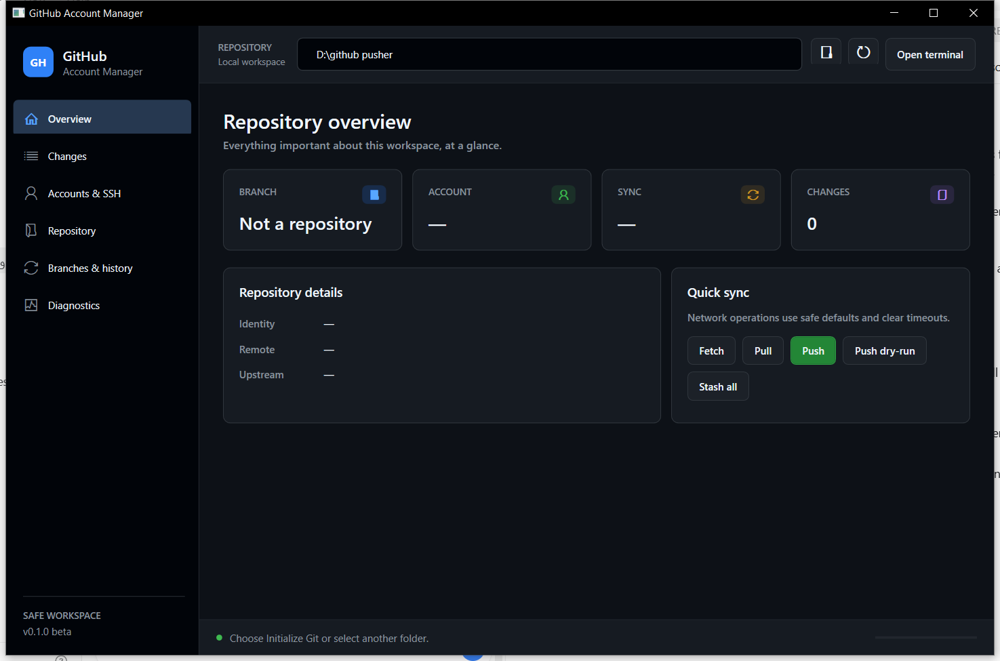
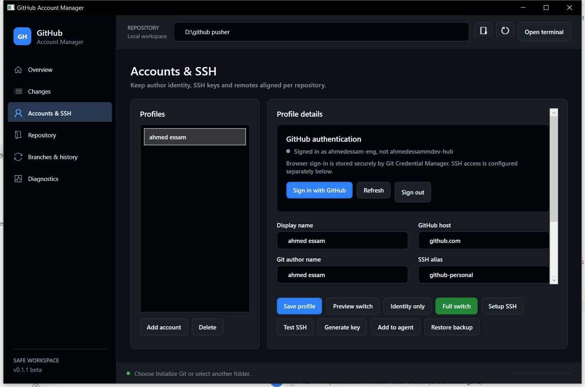
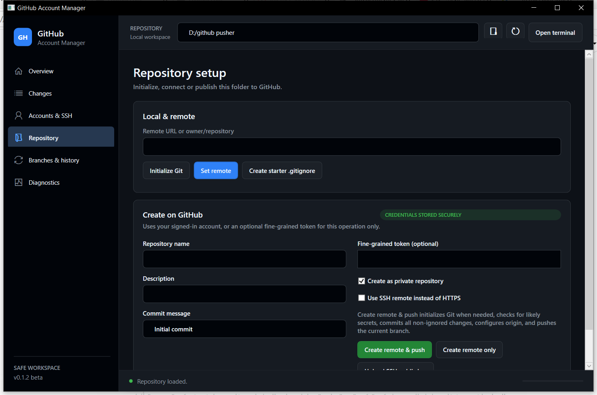
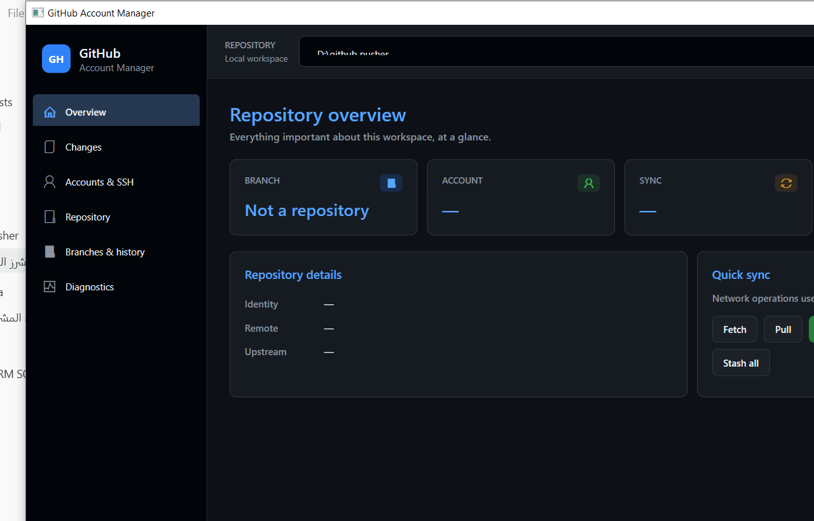
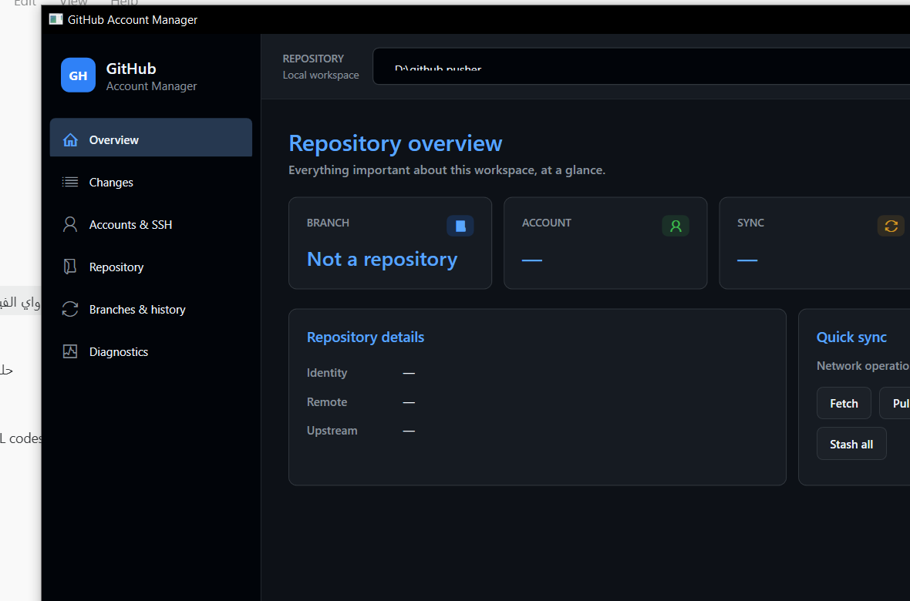
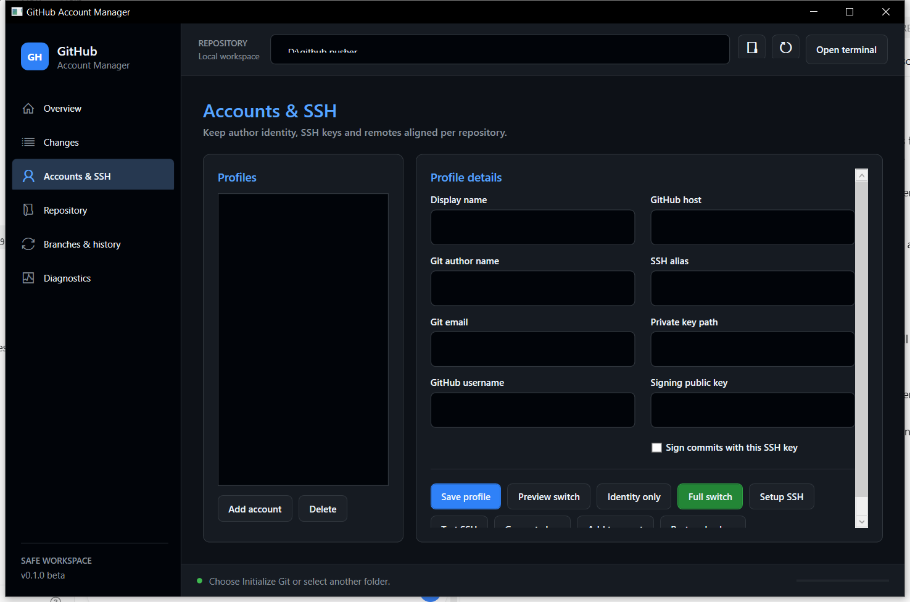

# GitHub Account Manager

A safe, portable Windows desktop application for managing Git repositories, GitHub accounts, SSH identities, commits, branches, remotes, and publishing workflows from one interface.

## Highlights

- One self-contained `GitHubAccountManager.exe`; no .NET installation is required on the target PC.
- Opens the current folder automatically or accepts `--repo "D:\path\to\project"`.
- Dashboard for branch, account, upstream, remote, sync state, and working-tree changes.
- Stage selected/all files, unstage, commit, commit-and-push, fetch, fast-forward pull, push, dry-run push, and stash.
- Create/switch branches and inspect recent history.
- Configure unlimited GitHub or GitHub Enterprise account profiles.
- Sign in through the browser, inspect authentication status, and sign out securely through Git Credential Manager.
- Switch local Git identity and SSH remote with preflight verification, backups, and rollback.
- Generate SSH keys, manage dedicated SSH aliases, load keys into `ssh-agent`, and enable SSH commit signing.
- Initialize a repository, connect a remote, or create a GitHub repository using a fine-grained token kept only in memory.
- Publish a folder end-to-end: initialize Git, scan for likely secrets, commit non-ignored changes, create the remote repository, configure `origin`, and push the current branch.
- Warn before commits when likely secrets or private-key files appear in the working tree.

## Interface preview

### Repository overview



### Accounts and SSH



### Create a remote and publish the current folder



<details>
<summary>Earlier design iterations</summary>







</details>

## Requirements

- Windows 10 or later, x64.
- Git for Windows in `PATH`, including Git Credential Manager for browser authentication.
- Windows OpenSSH client in `PATH` for SSH account features.

GitHub CLI and Windows Terminal are optional. The application falls back to PowerShell when Windows Terminal is unavailable.

## Build

```powershell
.\scripts\build.ps1
```

The build restores dependencies, runs all tests, publishes one self-contained executable, and writes its checksum:

```text
dist/GitHubAccountManager.exe
dist/SHA256SUMS.txt
```

## Development

```powershell
dotnet restore GitHubAccountManager.sln
dotnet build GitHubAccountManager.sln -c Release
dotnet test tests/GitHubAccountManager.Tests/GitHubAccountManager.Tests.csproj -c Release
dotnet run --project src/GitHubAccountManager.App/GitHubAccountManager.App.csproj -- --repo "D:\code\project"
```

## Publish a folder

1. Open **Accounts & SSH**, select the intended profile, and complete **Sign in with GitHub**.
2. Open **Repository** and enter a repository name, optional description, visibility, and commit message.
3. Keep HTTPS selected to reuse browser authentication, or select SSH after configuring and testing the account key.
4. Choose **Create remote & push**. The application initializes Git when needed, rejects likely secret files, commits all non-ignored changes, creates the GitHub repository, configures `origin`, and pushes the current branch with upstream tracking.

Use **Create remote only** when the remote should be created and connected without committing or uploading local files.

## Account data and secrets

Account profiles are written to `%APPDATA%\GitHubAccountManager\settings.json`. This file is outside repositories and contains account identifiers and key paths, but never private-key contents.

Browser authentication is stored by Git Credential Manager in the Windows credential store. Repository creation and SSH-key upload use the selected signed-in account automatically. A fine-grained token can still be supplied for a single operation; manually entered tokens are held in memory and are never persisted.

## Safety decisions

- All process arguments are passed separately; user input is never interpolated into a shell command.
- Pull uses `--ff-only` to avoid surprise merge commits.
- Existing SSH files receive timestamped backups.
- Account switches create retention-limited backups in Git metadata and roll back after verification failure.
- Existing SSH keys and `.gitignore` files are never overwritten.
- Force push, hard reset, and silent change deletion are intentionally absent from the main interface.

See [troubleshooting](docs/TROUBLESHOOTING.md), [security policy](SECURITY.md), [contributing guide](CONTRIBUTING.md), and [changelog](CHANGELOG.md).

## License

MIT
